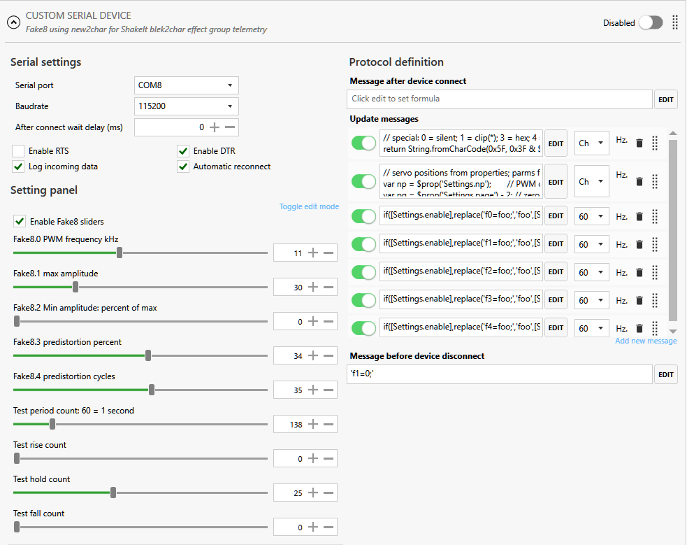
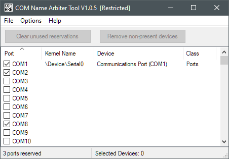

---
Fake8:&nbsp; proposed SimHub 8-bit serial plugin
---

As noted in [Arduino for STM32 Black 'n Blue Pills, ESP32-S[2,3] ](https://blekenbleu.github.io/Arduino/),  
 [SimHub's **Custom Serial devices** plugin](https://github.com/SHWotever/SimHub/wiki/Custom-serial-devices) has limitations
- SimHub plugin Javascript is relatively inefficient, hard to debug and maintain.
- Plugin can log but not process received serial port messages from e.g. from Arduino.
- Serial data is limited to 7 bits per character.

This `Fake8` SimHub plugin connects to (Arduino) device serial ports,
using 8 bit characters and executing C#,  
working with SimHub's Custom Serial devices plugin by properties.
and a **signed** [virtual com0com Null-modem](https://pete.akeo.ie/2011/07/com0com-signed-drivers.html).  
This leverages the **SimHub Custom Serial devices** plugin user interface:  
  
... while much of the heavy lifting gets done by this `Fake8` plugin.  
Sadly, `Custom Serial devices` user interface Settings are local to that plugin
and inaccessible by `Fake8`.  
Consequently, [the `Custom Serial devices` profile](https://raw.githubusercontent.com/blekenbleu/SimHub-profiles/main/Fake8.shsds)
 must send those control settings via `Fake8` Serial port.  
Overhead is minimized by using simple [NCalc](https://github.com/SHWotever/ncalc) expressions to generate setting change messages.  
Unlike JavaScript, NCalc Update messages repeat even if unchanged unless explicitly conditional
 by [change()](https://github.com/SHWotever/SimHub/wiki/NCalc-scripting).  
Incoming `Fake8` serial data to SimHub's **Custom Serial** plugin will generally combine Arduino and `Fake8` strings.

`Fake8` to Arduino will approximate MIDI protocol, with:  
- only first message 8-bit characters having msb ==1
- 7 lsb of first message character are a command
- second character is 7-bit data
- for some commands, that second character 7-bit data is count for appended 7-bit character array of values.  
  One string command to echoes that string.  
  One non-string command echoes that second character.  
  Another non-string command resets the Arduino run-time sketch.
- for commands with 1 == second-most significant bit of first message character,  
  3 lsb index Arduino device application-specific settings, such as
  - setting **PWM** pin parameters, e.g.:&nbsp; frequency, % range, predistortion, PWM pin number, clock number

This supports 80 commands:
   - 16 for application-specific settings with 3-bit indexing.
   - 64 for string and other purposes.

## Status 3 Mar 2023
- plugin communicates both with SimHub Custom Serial plugin (via com0com) and STM32 Arduino
   - current Arduino sketch merely echos ASCII hex for received bytes, confirming 8-bit communications
- next step will be adding configurable PWM to the Arduino sketch  
  for e.g. PC fans and [**Direct Drive harness tension**](https://github.com/blekenbleu/Direct-Drive-harness-tension-tester) testing.

## Problems encountered
- SourceForge's `com0com` virtual null modem package **does not work on recent Windows 10 versions**.
   - get [Pete Batard's](https://pete.akeo.ie/2011/07/com0com-signed-drivers.html) **signed** [`com0com` driver](https://files.akeo.ie/blog/com0com.7z).
   - an alternative `may be` [test-signing](https://learn.microsoft.com/en-us/windows-hardware/drivers/install/the-testsigning-boot-configuration-option) the SourceForge `com0com` driver.
- Trying to use `com0com` virtual COM ports in C# **fails** *unless its PortName begins with* `COM`.  
    - Free 'busy' COM port numbers using [COM Name Arbiter Tool](https://www.uwe-sieber.de/misc_tools_e.html#com_ports)  
       Run as Adminstrator, uncheck wanted and currently unused ports:  
         
- `Arduino.DtrEnable = true;` is required [for C# to read from Arduino](https://forum.arduino.cc/t/serial-communication-with-c-program-serialdatareceivedeventhandler-doesnt-work/108564/3), but not for com0com.
- Unable to restart Arduino sketch by toggling `Arduino.DtrEnable` and `Arduino.RtsEnable`.

## Configure a [`com0com` virtual null modem](https://files.akeo.ie/blog/com0com.7z)
- Run as Adminstrator `com0com\setupc.exe`: &nbsp;   (see [com0com ReadMe](https://raw.githubusercontent.com/paulakg4/com0com/master/ReadMe) for instructions)
```
command> change CNCB0 PortName=COM2
       CNCA8 PortName=-
       CNCB8 PortName=-
       CNCA0 PortName=FAKE8
       CNCB0 PortName=SIM8
change CNCB0 PortName=COM2
Restarted CNCB0 com0com\port \Device\com0com20
ComDB: COM2 - logged as "in use"
command> change CNCB0 ExclusiveMode=yes
       CNCA8 PortName=-
       CNCB8 PortName=-
       CNCA0 PortName=FAKE8
       CNCB0 PortName=COM2
change CNCB0 PortName=COM2,ExclusiveMode=yes
Restarted CNCB0 com0com\port \Device\com0com20
command> change CNCA0 PortName=COM8
       CNCA8 PortName=-
       CNCB8 PortName=-
       CNCA0 PortName=FAKE8
change CNCA0 PortName=COM8
Restarted CNCA0 com0com\port \Device\com0com10
       CNCB0 PortName=COM2,ExclusiveMode=yes
ComDB: COM8 - logged as "in use"
command> change CNCA0 PlugInMode=yes
       CNCA8 PortName=-
       CNCB8 PortName=-
       CNCA0 PortName=COM8
change CNCA0 PortName=COM8,PlugInMode=yes
Restarted CNCA0 com0com\port \Device\com0com10
       CNCB0 PortName=COM2,ExclusiveMode=yes
command> list
       CNCA8 PortName=-
       CNCB8 PortName=-
       CNCA0 PortName=COM8,PlugInMode=yes
       CNCB0 PortName=COM2,ExclusiveMode=yes
```
Seemingly, `PlugInMode=yes` and `ExclusiveMode=yes` make no difference..

### potentially useful C# serial port references

- [Serial Port Communication](https://www.codeproject.com/Tips/361285/Serial-Port-Communication) *codeproject.com* "Although the code is self explanatory, I will explain little."
- [Serial Comms in C# for Beginners](https://www.codeproject.com/Articles/678025/Serial-Comms-in-Csharp-for-Beginners) *codeproject.com* useful, ignoring hardware pin handling
- [Improving the Performance of Serial Ports Using C#](https://www.codeproject.com/Articles/110670/Improving-the-Performance-of-Serial-Ports-Using-C) *codeproject.com*
- [Arduino, C#, and Serial Interface](https://www.codeproject.com/Articles/473828/Arduino-Csharp-and-Serial-Interface) *codeproject.com* 
- [Close Serial COM Port safely in C#](https://www.codeproject.com/Questions/281222/Close-Serial-COM-Port-safely-in-Csharp) *codeproject.com*
- [Top 5 SerialPort Tips](https://learn.microsoft.com/en-us/archive/blogs/bclteam/top-5-serialport-tips-kim-hamilton)
- [SerialPort Encoding](https://learn.microsoft.com/en-us/archive/blogs/bclteam/serialport-encoding-ryan-byington)
- [learn SerialPort Class](https://learn.microsoft.com/en-us/dotnet/api/system.io.ports.serialport?view=dotnet-plat-ext-7.0)
- [*instructables* Serial Port Programming With .NET](https://www.instructables.com/Serial-Port-Programming-With-NET/)
- [Communicate with Serial Port in C#](https://www.c-sharpcorner.com/UploadFile/eclipsed4utoo/communicating-with-serial-port-in-C-Sharp/) *c-sharp corner*
- [**Signed com0com** Null-modem emulator](https://pete.akeo.ie/2011/07/com0com-signed-drivers.html) - Link for [Installing;&nbsp; FAQs](https://raw.githubusercontent.com/paulakg4/com0com/master/ReadMe)
